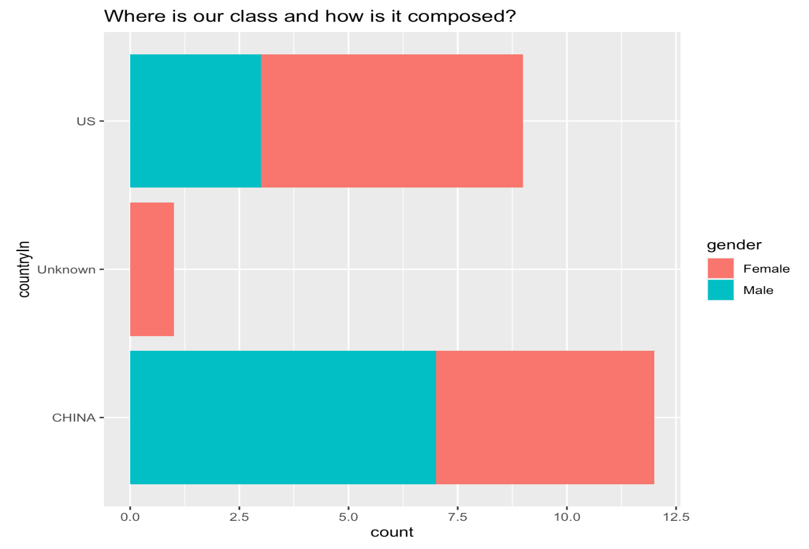
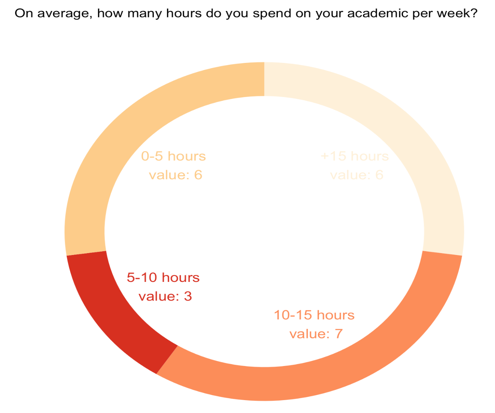
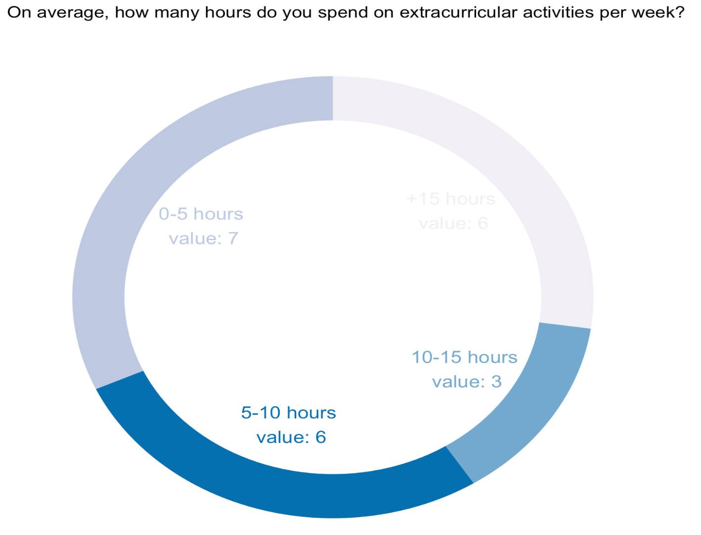
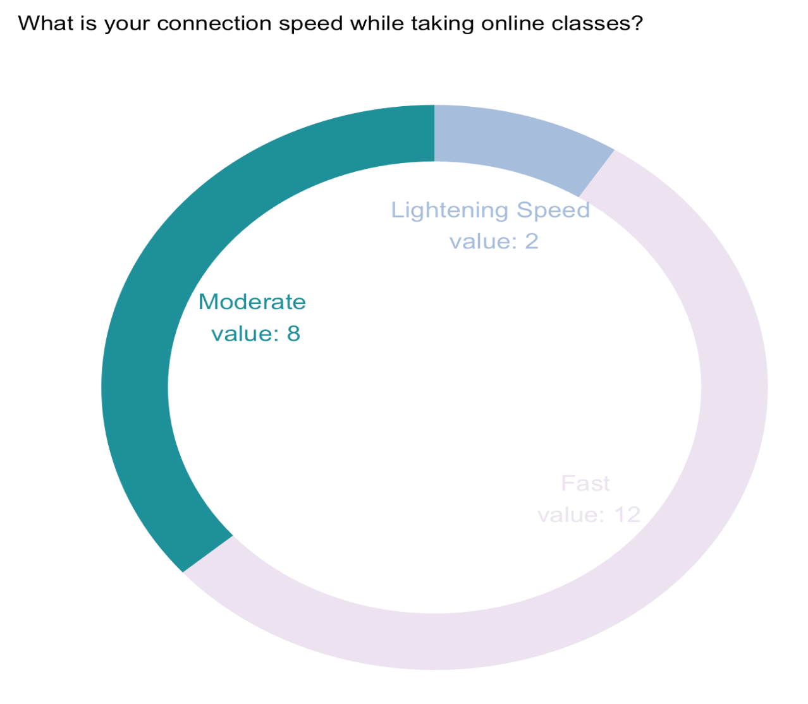
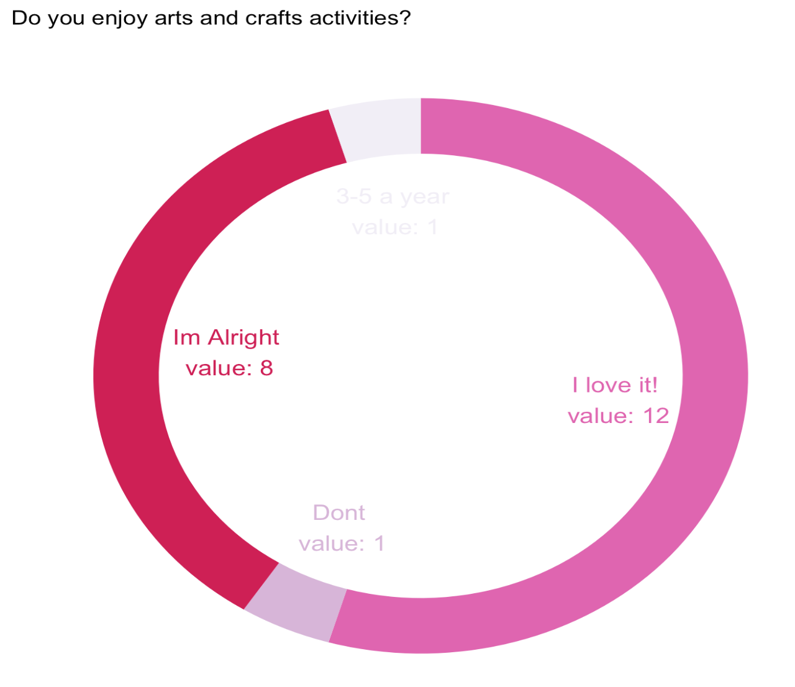

# Origami-Lesson

We taught a synchronous origami lesson to our Feature Engineering Studio class. We were interested in seeing how a mechanical skill could be taught online and whether students would be engaged in completing the task and their overall interest and success. We explored our data through basic demographic information and asking whether the students even like working on hobbies such as origami, which we deployed in our Shiny App. This information can be found in the first tab of our Shiny App. Then we created a prediction model for several factors, which we also included in the Shiny App as a html output of the RMarkdown where we evaluated the data.

## Data Analysis

* Demographics
**Relevant information on the break down on the classmates that participated in our synchronous origami lesson.  
  
 
 
 
 

* Predictions
**Decision tree algorithm - Basics and visual representation: The algorithm of decision tree models works by repeatedly partitioning the data into multiple sub-spaces, so that the outcomes in each final sub-space is as homogeneous as possible. This approach is technically called recursive partitioning. In the html output you will see the entire process of data wrangling, analysis, and modeling results. 

## ShinyApp

* Created a ShinyApp that contains the data analysis of the Origami Lesson Data.
 

# Files  

* Origami.Rmd cleans the data, creates our graphs, and begins the building of the Shiny App. **Must execute cleaning and graphs code before launching the shiny app**       
* Origami_Prediction.Rmd calculates our predictions holds our decision tree algorithm (basics and visual representations): The algorithm of decision tree models works by repeatedly partitioning the data into multiple sub-spaces, so that the outcomes in each final sub-space is as homogeneous as possible. This approach is technically called recursive partitioning. This Rmd holds output you will see the entire process of data wrangling, analysis, and modeling results.   
* Origami_Prediction.html is the html output of Origami_Prediction.Rmd that will be called into the Shiny App.  
* OrigamiShiny Folder holds the Origami.R and Origami_Prediction.html that launch our Shiny App.    
* OrigamiSurvey.csv is the data downloaded from the Google Survey.   
* OrigamiSurveyUpdate.csv is the data but with the frog and butterfly columns updated.   

# Codebook

timestamp - "Timestamp"  
id - "TC ID"  
gender - "What is your gender?"  
countryIn - "Which country are you taking your online classes from presently?"  
HoursPerWeekStudying - "On average, how many hours do you spend on your academic per week?"  
HoursPerWeekExtracurriculars - "On average, how many hours do you spend on extracurricular activities per week?"  
technology - "What technology do you use for online learning?"  
internetSpeed - What is your connection speed while taking online classes?"  
enjoyArtsAndCrafts - "Do you enjoy arts and crafts activities?"  
findsOrigamiRelaxing - "Do you personally find origami to be a relaxing activity?"  
engagingLesson - "How engaging was the lesson? Do you think the video format works for online origami classes?"  
aDifferentFormat - "Would you have preferred this online origami class in a different format? If so, what do you suggest?"  
clearInstructions - "How did you find the instruction/directions of the session?"  
motivation - "How motivated were you in completing the origami?"  
completionToWhere - "Did you complete both the origami, and if you did not, at what point did you stop?"  
whyStopped - "If you stopped the activity within the assigned 20 minutes, why did you stop? (e.g. lack of motivation, difficulty levels, etc)"  
bestFormat - "Which format would be most joyful for an Origami class, in your opinion? (Under non-pandemic conditions)"  
reasonsNotToTake - "What would potentially stop you from taking an online origami class?"  
butterfly - "Please insert a photograph of your origami butterfly." (manually evaluated for incorrect or correct completion -- given a yes or no)  
frog - "Please insert a photograph of your origami frog." (manually evaluated for incorrect or correct completion -- given a yes or no)  